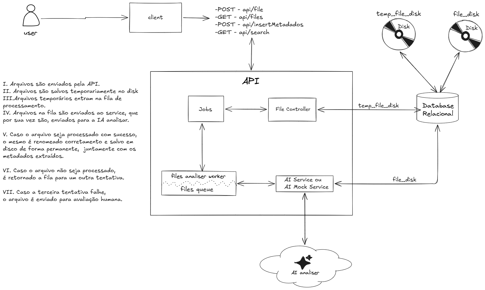

# ADR-003: Arquitetura de Processamento Assíncrono com Discos Segregados e Ciclo de Vida Documental

## Status
Aceito

## Contexto
O DOC Intelligence recebe uploads de arquivos despadronizados enviados pela aplicação cliente. Como o tempo de resposta da IA externa porde variar em segundos e ocorrem picos de mais de requisições, processar o arquivo de forma síncrona ou manter arquivos não validados no armazenamento definitivo compromete o desempenho da API, a organização do sistema e a segurança dos dados pessoais.

## Decisão
Implementar o pipeline assíncrono com separação de armazenamento em dois discos e orquestração por fila de mensageria:
* **Ingestão e Armazenamento Temporário:** A API (`File Controller`) recebe o upload, persiste o registro no banco de dados relacional e armazena o arquivo bruto em `temp_file_disk` (isolado e com retenção curta), disparando um `Job` para a fila `files_queue`.
* **Processamento Assíncrono:** O *worker* (`files analyser worker`) consome o trabalho da fila e invoca o serviço de análise (`AI Service` / `AI Mock Service`), isolando a comunicação externa da API principal.
* **Processamento com Sucesso:** Com a extração concluída, o arquivo é renomeado para o padrão do escritório, promovido para o disco definitivo (`file_disk`) e os metadados são consolidados no banco relacional. O arquivo temporário é expurgado.
* **Políticas de Falha e Retentativa:** Se a chamada à IA falhar, o *Job* retorna para a fila para uma nova tentativa (até o limite de 3 tentativas).
* **Fallback para Conferência Humana:** Caso a 3ª tentativa falhe irrevogavelmente, o documento é roteado automaticamente com status de revisão para avaliação humana na interface interna.
* **Exposição de Endpoints:** A API expõe rotas REST específicas (`POST /api/file`, `GET /api/files`, `POST /api/insertMetadados`, `GET /api/search`) para permitir a integração e consulta pelos sistemas internos.

## Alternativas Descartadas
* **Processamento Síncrono no Upload:** Descartado por gerar *time-out* HTTP e bloquear a aplicação durante picos de carga.
* **Armazenamento Único sem Isolamento Temporário:** Descartado para evitar acúmulo de arquivos órfãos/corrompidos misturados aos documentos processados e validados no disco principal.

## Consequências
* Desacoplamento total entre o tempo de resposta da API de upload e o tempo de análise da IA.
* Garantia de rastreabilidade do ciclo de vida do arquivo do recebimento ao arquivamento definitivo.
* Exige rotina de limpeza periódica para garantir que falhas não acumulem lixo em `temp_file_disk`.

