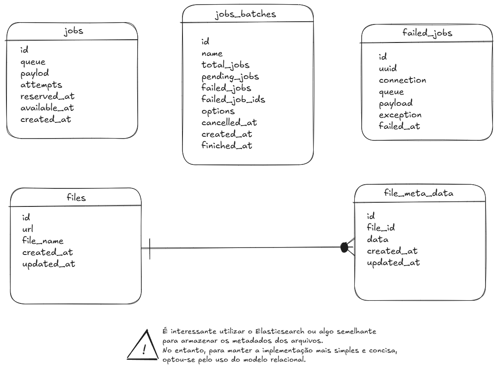

# ADR-004: Modelagem Relacional e Metadados

## Status
Aceito

## Contexto
O serviço DOC Intelligence precisa persistir o histórico de arquivos processados e os metadados dinâmicos extraídos pela inteligência artificial (como campos de RG, CNH, contracheques e laudos). A modelagem deve equilibrar flexibilidade para formatos variados de documentos com a simplicidade operacional exigida.

## Decisão
Adotar um modelo de dados relacional segregado em duas camadas funcionais:

* **Domínio Documental (Particionamento 1:N):**
  * `files`: Tabela mestre contendo os metadados físicos e de trânsito do arquivo (`id`, `url`, `file_name`, timestamps).
  * `file_meta_data`: Tabela filha vinculada (`file_id`) com coluna `data` para armazenar as entidades e dados extraídos pela IA, permitindo flexibilidade estrutural por tipo documental e histórico incremental sem inflar a tabela principal.
* **Infraestrutura de Filas e Lotes (Driver Relacional / Database):**
  * `jobs`: Tabela de enfileiramento transacional para orquestrar os trabalhos pendentes (`payload`, `attempts`, `reserved_at`, `available_at`).
  * `jobs_batches`: Controle de processamento em lote (`total_jobs`, `pending_jobs`, `failed_jobs`, etc.) para monitoramento de envios volumosos.
  * `failed_jobs`: Registro formal e isolado de falhas irrecuperáveis (`exception`, `payload`, `failed_at`) para fins de auditoria técnica.

## Alternativas para Implementação Futura
* **Elasticsearch / OpenSearch para Metadados:** Embora ofereça alto desempenho para buscas textuais complexas em metadados desestruturados, adicionaria complexidade de cluster, sincronização e custos de infraestrutura incompatíveis com o escopo da fatia vertical inicial.
* **Tabela Única Desnormalizada (`files` com metadados embutidos):** Descartada para evitar bloqueios de linha e permitir evolução independente do esquema de metadados sem impactar as operações básicas de I/O de arquivos.

## Consequências
* Redução de dependências externas: a aplicação inteira (domínio + mensageria) roda sobre a mesma base relacional.
* Facilidade para evoluir futuramente para bancos baseados em documentos ou motores de busca (Elasticsearch) apenas reescrevendo a camada de consulta da tabela `file_meta_data`.
* Tabelas de fila em banco relacional (`jobs`) podem sofrer gargalos de I/O sob volumes extremos de concorrência, servindo como ponto de atenção para escala futura.

